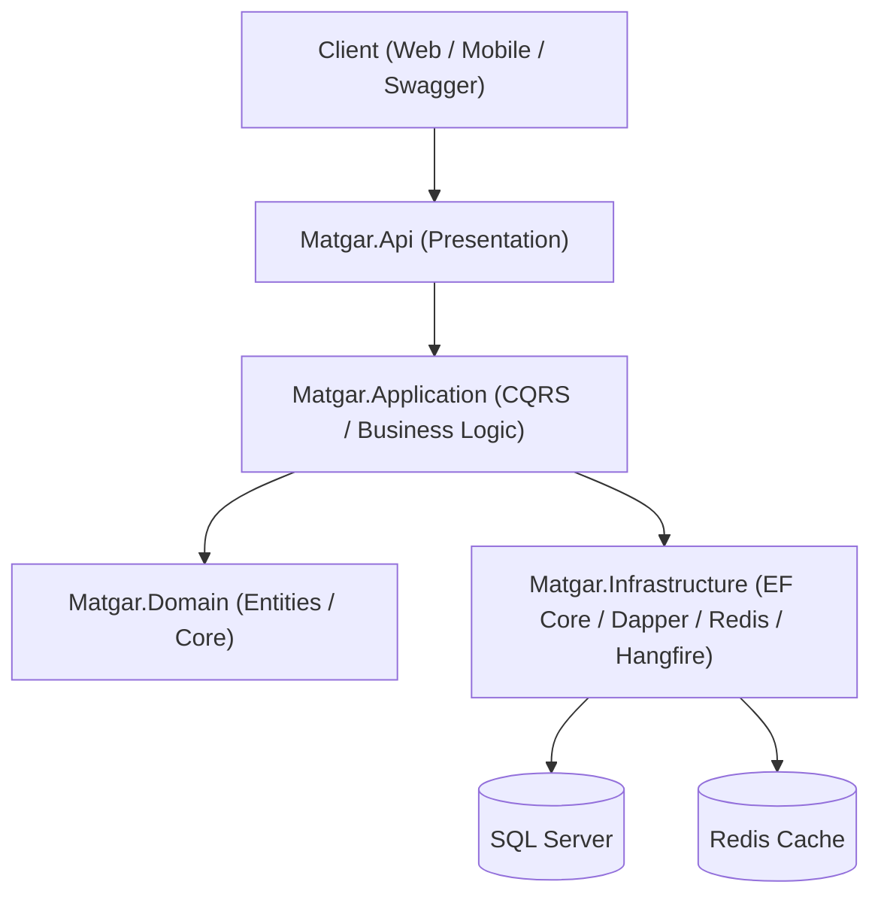

# Matgar

A robust, enterprise-grade e-commerce backend Web API built with modern **.NET 10** and **Clean Architecture**.

---

## Overview

**Matgar** is a scalable, feature-rich e-commerce platform API designed to provide robust backend capabilities for modern online retail systems. It handles core e-commerce workflows including product management, variant attributes, shopping carts, checkout and orders (admin, vendor, and customer order management), coupons, payment processing, product reviews, notifications, and user authentication/authorization.

The API is engineered following industry best practices and design patterns to ensure high maintainability, testability, performance, and security.

---

## Features

- **Authentication & Authorization**: Secure JWT-based authentication with ASP.NET Core Identity, refresh tokens, and role-based access control.
- **Product & Inventory Management**: Comprehensive product catalog, categories, product variants, stock items, and product status tracking.
- **Shopping Cart**: Cart and cart item management for user sessions.
- **Order Management**: End-to-end order processing, checkout, cancellation, and dedicated management endpoints for customers, vendors, and administrators.
- **Discounts & Coupons**: Coupon creation, validation, and discount application (percentage/fixed).
- **Payments**: Payment processing integration supporting multiple providers and status tracking.
- **Product Reviews & Ratings**: Verified purchase reviews and rating management.
- **Addresses**: Customer shipping and billing address management.
- **Notifications & Background Jobs**: Notification logging, email services via MailKit, and background job processing using **Hangfire**.
- **Caching**: Distributed caching with Redis (`IDistributedCache` and `IConnectionMultiplexer`).
- **Resilience & Performance**: CQRS pattern via MediatR, pipeline behaviors (validation, logging, caching), built-in rate limiting, and health checks (database and Redis).
- **API Documentation & Versioning**: OpenAPI / Swagger documentation and URL segment API versioning.
- **Structured Logging**: Request and application logging via Serilog (Console and File sinks).

---

## Technology Stack

| Technology | Purpose |
|------------|---------|
| **.NET 10** | Modern, high-performance cross-platform runtime |
| **ASP.NET Core Web API** | RESTful API framework |
| **Entity Framework Core 10** | ORM for database migrations, entities, and data persistence (SQL Server) |
| **Dapper** | High-performance micro-ORM for read-heavy queries and reporting |
| **SQL Server** | Primary relational database |
| **Redis** | Distributed caching and high-performance store |
| **Hangfire** | Background job processing and outbox message handling |
| **MediatR** | In-process messaging for CQRS pattern implementation |
| **FluentValidation** | Robust input validation and pipeline behaviors |
| **MailKit** | SMTP email sending (Gmail integration) |
| **Serilog** | Advanced structured logging |
| **Docker & Docker Compose** | Containerization and local orchestration of API, SQL Server, and Redis |

---

## Architecture

Matgar strictly adheres to **Clean Architecture** principles, separating concerns into four core layers:

1. **Domain Layer**: Contains enterprise business logic, entities, value objects, enums, and domain exceptions. Completely independent of external frameworks.
2. **Application Layer**: Implements use cases, CQRS commands/queries via MediatR, FluentValidation pipeline behaviors, caching behaviors, DTOs, and application interfaces.
3. **Infrastructure Layer**: Implements database persistence (EF Core Context, repositories, Unit of Work, migrations, Dapper queries), identity services, authentication, caching, Hangfire, and external service adapters (Email, Outbox processor).
4. **API Layer**: ASP.NET Core Web API entry point containing controllers, API versioning, health checks, global exception handling, rate limiting, and dependency injection setup.



---

## Project Structure

```text
Matgar/
├── src/
│   ├── Matgar.Api/          # Controllers, Extensions, HealthChecks, Middlewares, Program.cs
│   ├── Matgar.Application/  # CQRS Features, Behaviors, DTOs, Abstractions, Validators
│   ├── Matgar.Domain/       # Entities, Enums, Core Business Rules
│   └── Matgar.Infrastructure/# EF Core, Dapper, Repositories, Identity, Hangfire, Services
└── docker-compose.yml       # Local orchestration (API, SQL Server, Redis)
```

---

## Configuration & Environment Variables

The project separates non-sensitive defaults (`appsettings.json`) from environment-specific templates (`*.example`):

- **`appsettings.json`**: Common non-sensitive defaults (logging, allowed hosts, rate limiting).
- **`appsettings.Development.json.example`**: Local development configuration template.
- **`appsettings.Docker.json.example`**: Docker environment configuration template.
- **`appsettings.Production.json.example`**: Production configuration template.

### Secrets Management Strategy
- **Local Development**: Use ASP.NET Core User Secrets (`dotnet user-secrets`).
- **Docker / Local Containers**: Use a local `.env` file (gitignored) supplying environment variables via double-underscore hierarchical syntax (`ConnectionStrings__DefaultConnection`, `JwtOptions__Key`, etc.).
- **Production**: Inject secrets securely via cloud secret managers or environment variables. **Never commit real credentials to Git.**

---

## Getting Started

### Prerequisites
- .NET 10 SDK
- SQL Server (or Docker)
- Redis (or Docker)

### 1. Local Setup & Running
1. Clone the repository and navigate to the project directory.
2. Initialize and set development secrets:
   ```powershell
   cd src/Matgar.Api
   dotnet user-secrets init
   dotnet user-secrets set "ConnectionStrings:DefaultConnection" "Your_SQL_Connection_String"
   dotnet user-secrets set "JwtOptions:Key" "Your_Secure_Jwt_Signing_Key_Min_32_Bytes"
   ```
3. Run the application:
   ```powershell
   dotnet run --launch-profile http
   ```

### 2. Running with Docker Compose
1. Copy `.env.example` to `.env`:
   ```powershell
   Copy-Item .env.example .env
   ```
2. Populate `.env` with your secure connection strings and keys.
3. Build and run containers:
   ```powershell
   docker compose up --build
   ```
4. Access Swagger API documentation at `http://localhost:5203/swagger` (when running in development).
